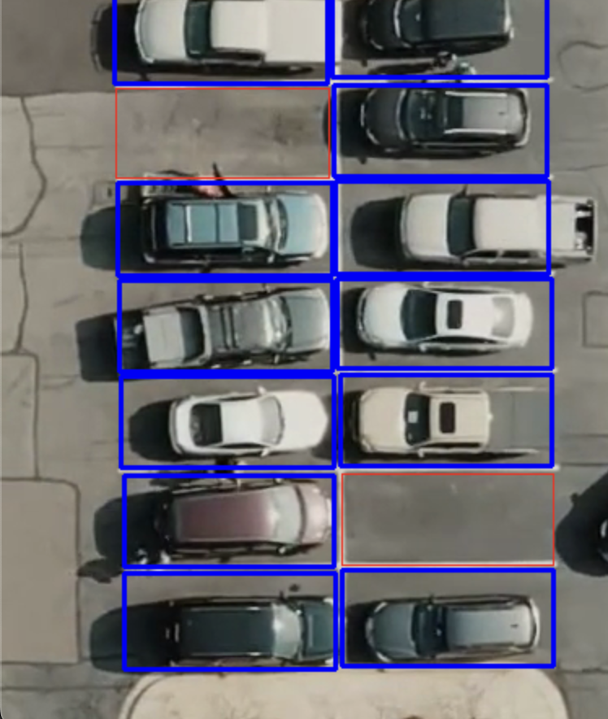

# Parking Space Detection Project

This project aims to detect empty parking spaces in a video using machine learning techniques. The project utilizes the scikit-learn library for machine learning algorithms, OpenCV for image processing, and SVM (Support Vector Machine) as the classifier.
   
The program will process the video and output the detected empty parking spaces.

   

## Technologies Used

- scikit-learn: Machine learning library for training SVM classifier.
- OpenCV: Computer vision library for image processing and analysis.

## Acknowledgements

This project was inspired by the need for efficient parking space management in urban areas. Special thanks to the contributors of scikit-learn and OpenCV for their amazing libraries.

Happy parking space detection! 🚗🅿️
